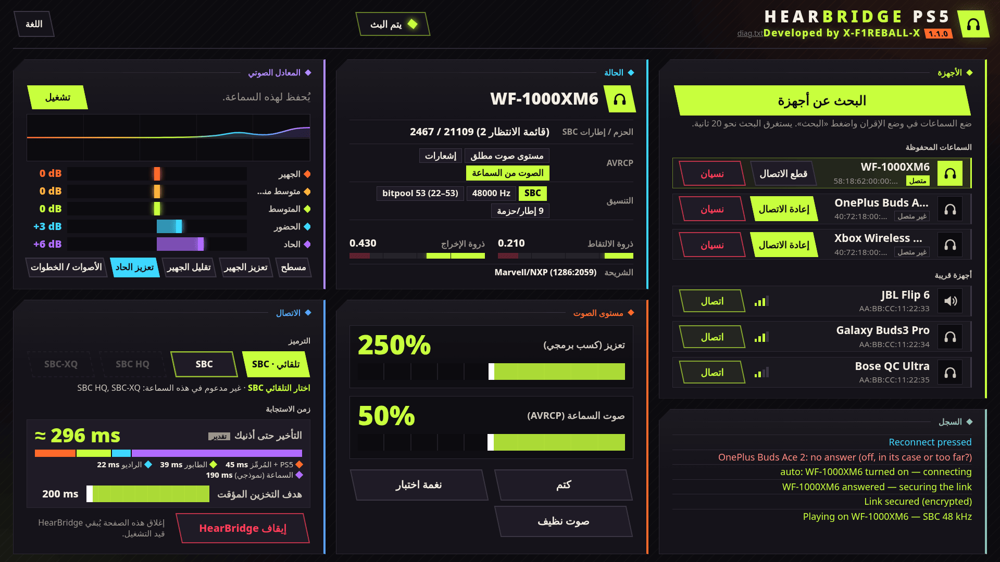

<div align="center">

# HearBridge PS5

**سماعات بلوتوث لجهاز PS5 مكسور الحماية: صوت الألعاب والنظام، بدون دونجل.**

تطوير **X-F1REBALL-X**

🇺🇸 [English](README.md) · 🇸🇦 **العربية** · 🇪🇸 [Español](README.es.md) · 🇫🇷 [Français](README.fr.md) · 🇩🇪 [Deutsch](README.de.md) · 🇧🇷 [Português](README.pt.md) · 🇷🇺 [Русский](README.ru.md) · 🇯🇵 [日本語](README.ja.md) · 🇨🇳 [中文](README.zh.md) · 🇮🇹 [Italiano](README.it.md) · 🇮🇱 [עברית](README.he.md)

</div>

<div dir="rtl">

HearBridge PS5 حمولة (ELF) لجهاز PS5 مكسور الحماية. تبث صوت الجهاز عبر بلوتوث PS5 نفسه إلى سماعات أو مكبر صوت بلوتوث عادي (A2DP). يتم التحكم فيها من صفحة ويب يقدمها الجهاز. لا تمس الألعاب ولا البرنامج الثابت ولا كسر الحماية.

<p align="center"></p>

## المتطلبات

- جهاز PS5 مكسور الحماية مع محمّل ELF على المنفذ **9021** (elfldr).
- سماعات أو مكبر صوت بلوتوث يدعم A2DP (SBC، 48 kHz ستيريو).
- متصفح على نفس الشبكة (PS5 أو هاتف أو كمبيوتر).

## التثبيت والتشغيل

1. نزّل **HearBridge-PS5-1.2.0.elf** من [أحدث إصدار](https://github.com/X-F1REBALL-X/HearBridge-PS5/releases/latest).
2. أرسله إلى المحمّل: `socat -u FILE:HearBridge-PS5-1.2.0.elf TCP:<console-ip>:9021`
3. افتح **http://&lt;console-ip&gt;:8090**، أو أيقونة **HearBridge** في الشاشة الرئيسية.

إرسال ملف ELF مرة أخرى يستبدل النسخة العاملة. زر **Stop HearBridge** في الصفحة يوقفها.

## ما الشريحة الموجودة لدي؟

ملف واحد يعمل على شريحتَي البلوتوث، Marvell/NXP وMediaTek. يتعرّف HearBridge على الشريحة بنفسه ويعرضها في سطر **Chip** في لوحة **Status**.

| الطراز | شريحة البلوتوث |
|---|---|
| CFI-10xx (الإصدار الأول) | Marvell/NXP |
| CFI-11xx, CFI-12xx (fat) | Marvell/NXP أو MediaTek |
| CFI-20xx, CFI-21xx (Slim) | Marvell/NXP أو MediaTek |
| CFI-70xx, CFI-71xx (Pro) | MediaTek |

تم الاختبار على: PS5 fat ‏CFI-10xx ‏(Marvell/NXP)، PS5 Slim ‏CFI-2008 ‏(MediaTek). الطرازات الأخرى: أخبرنا كيف سارت الأمور.

يظهر أيضًا في `/data/hearbridge/hearbridge.log` في السطر `usb: /dev/ugen0.2 is 1286:2059 …`: ‏`1286` = Marvell/NXP، ‏`0e8d` = MediaTek.

المصادر: [Sony compliance (BR)](https://www.playstation.com/pt-br/legal/compliance/) · [24Wireless](https://24wireless.info/playstation-5-cfi-1100-series) · [TechInsights PS5 Pro teardown](https://www.techinsights.com/blog/sony-playstation-5-pro-teardown)

## الميزات

- **الإقران:** ضع السماعات في وضع الإقران، اضغط **Scan for devices** (20 ثانية)، ثم **Connect**.
- **الاتصال التلقائي:** السماعات المحفوظة تتصل وحدها عند تشغيلها أو إخراجها من العلبة. إخراج زوج محفوظ آخر ينتقل إليه. بعد **Disconnect** يدوي تنتظر **Connect**.
- **Disconnect / Forget:** ‏Disconnect يقطع الاتصال ويبقي السماعات محفوظة. Forget يقطع الاتصال ويحذفها.
- **الصوت:** التعزيز (تضخيم برمجي حتى 500 %، يبدأ من 250 %) وصوت السماعات (AVRCP، يبدأ من 50 %). يُحفظان لكل سماعة بعد تغييرهما. **Mute** و**Test tone** للفحص.
- **المعادل:** 5 نطاقات (±12 dB) مع إعدادات جاهزة، محفوظ لكل سماعة، مع محدد حتى لا يتشوه التعزيز.
- **التأخير:** هدف المخزن المؤقت من 60 إلى 200 ms (الافتراضي 200 ms) وتقدير مباشر للتأخير.
- **Clean sound:** يطفئ المعادل، ويعيد التعزيز إلى 250 % والمخزن المؤقت إلى 200 ms.
- **سجل** في الصفحة بكل خطوة، بالألوان: الأخضر نجح، الأحمر فشل، والأزرق لضغطاتك.

## الترميزات

- **Auto:** ‏SBC عادي، يعمل مع كل شيء.
- **SBC HQ** و**SBC-XQ:** تختارها يدويًا، فقط عندما تدعمها السماعات. غير المدعومة تظهر رمادية.

لا يوجد دعم لـ AAC وaptX وLDAC.

## قيود معروفة

- سماعة واحدة في كل مرة، بدون ميكروفون. التلفاز يستمر في تشغيل الصوت أيضًا.
- شغّل حمولة بلوتوث واحدة فقط في كل مرة. ذراع DualSense يستمر في العمل.
- سماعات مختبرة: Sony WF-1000XM6، OnePlus Buds Ace 2، Xbox Wireless Headset.

## حل المشكلات / الإبلاغ عن مشكلة

عند تشغيل الحمولة يجب أن يظهر الإشعار **"HearBridge &lt;version&gt;: starting"**. إذا لم يظهر، فالمحمّل لم يشغّلها.

الإعدادات والسماعات المحفوظة والسجل موجودة في `/data/hearbridge/`. للإبلاغ عن مشكلة:

1. نزّل `/data/hearbridge/hearbridge.log` و`diag.txt` عبر FTP (مثل [ftpsrv](https://github.com/ps5-payload-dev/ftpsrv)، المنفذ 2121). ‏`diag.txt` متاح أيضًا على http://&lt;console-ip&gt;:8090/api/diag.
2. افتح [issue على GitHub](https://github.com/X-F1REBALL-X/HearBridge-PS5/issues/new/choose) مع طراز الجهاز والبرنامج الثابت والمحمّل وإصدار HearBridge وملفات السجل.

</div>

## البناء

```sh
export PS5_PAYLOAD_SDK=/opt/ps5-payload-sdk   # ps5-payload-sdk v0.43
make ps5      # dist/HearBridge-PS5-<version>.elf
make test
make send PS5_HOST=<console-ip>
```

<div dir="rtl">

## الترخيص

GPL-3.0-or-later. راجع [LICENSE](LICENSE) و[NOTICE](NOTICE).

</div>
