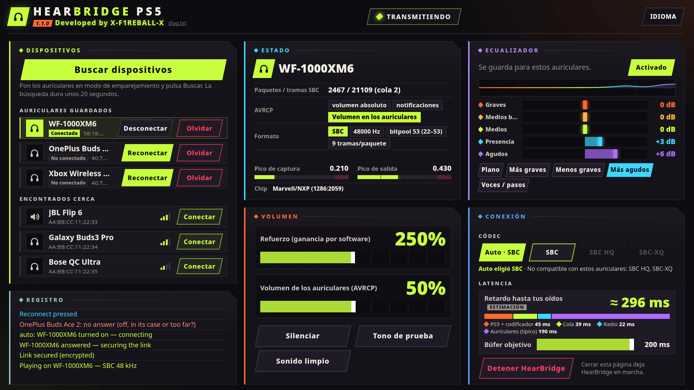

<div align="center">

# HearBridge PS5

**Auriculares Bluetooth para una PS5 con jailbreak: audio de juegos y del sistema, sin dongle.**

Desarrollado por **X-F1REBALL-X**

🇺🇸 [English](README.md) · 🇸🇦 [العربية](README.ar.md) · 🇪🇸 **Español** · 🇫🇷 [Français](README.fr.md) · 🇩🇪 [Deutsch](README.de.md) · 🇧🇷 [Português](README.pt.md) · 🇷🇺 [Русский](README.ru.md) · 🇯🇵 [日本語](README.ja.md) · 🇨🇳 [中文](README.zh.md) · 🇮🇹 [Italiano](README.it.md) · 🇮🇱 [עברית](README.he.md)

</div>

HearBridge PS5 es un payload (ELF) para una PS5 con jailbreak. Transmite el audio de la consola por el Bluetooth de la propia PS5 a auriculares o altavoces Bluetooth normales (A2DP). Se controla desde una página web que sirve la consola. No toca los juegos, el firmware ni el jailbreak.

<p align="center"></p>

## Requisitos

- Una PS5 con jailbreak y un cargador ELF en el puerto **9021** (elfldr).
- Auriculares o altavoz Bluetooth con A2DP (SBC, 48 kHz estéreo).
- Un navegador en la misma red (PS5, móvil o PC).

## Instalar y ejecutar

1. Descarga **HearBridge-PS5-1.1.0.elf** de la [última versión](https://github.com/X-F1REBALL-X/HearBridge-PS5/releases/latest).
2. Envíalo al cargador: `socat -u FILE:HearBridge-PS5-1.1.0.elf TCP:<console-ip>:9021`
3. Abre **http://&lt;console-ip&gt;:8090**, o el icono **HearBridge** de la pantalla de inicio.

Enviar el ELF otra vez reemplaza la copia en ejecución. **Stop HearBridge** en la página lo detiene.

## ¿Qué chip tengo?

Las PS5 usan uno de dos chips Bluetooth: Marvell/NXP o MediaTek. Las fat (CFI-11xx/12xx) y las Slim (CFI-20xx/21xx) pueden traer cualquiera de los dos, incluso con el mismo número de modelo.

| Modelo | Descarga |
|---|---|
| CFI-10xx (lanzamiento) | [1.1.0](https://github.com/X-F1REBALL-X/HearBridge-PS5/releases/tag/v1.1.0) |
| CFI-11xx, CFI-12xx (fat) | Mira tu chip: Marvell/NXP → [1.1.0](https://github.com/X-F1REBALL-X/HearBridge-PS5/releases/tag/v1.1.0), MediaTek → [mediatek test](https://github.com/X-F1REBALL-X/HearBridge-PS5/releases/tag/v1.1.0-mtk-test) |
| CFI-20xx, CFI-21xx (Slim) | Mira tu chip: Marvell/NXP → [1.1.0](https://github.com/X-F1REBALL-X/HearBridge-PS5/releases/tag/v1.1.0), MediaTek → [mediatek test](https://github.com/X-F1REBALL-X/HearBridge-PS5/releases/tag/v1.1.0-mtk-test) |
| CFI-70xx, CFI-71xx (Pro, siempre MediaTek) | [mediatek test](https://github.com/X-F1REBALL-X/HearBridge-PS5/releases/tag/v1.1.0-mtk-test) |

Probado: 1.1.0 en PS5 fat CFI-10xx (Marvell/NXP), mediatek test en PS5 Slim CFI-2008 (MediaTek). Otros modelos: cuéntanos cómo te va.

**Cómo comprobarlo:** ejecuta 1.1.0 y mira la fila **Chip** abajo en el panel **Status**. `Marvell/NXP (1286:…)` → sigue con 1.1.0. `MediaTek (0e8d:…)` → usa mediatek test (la página también muestra un aviso naranja). O abre `/data/hearbridge/hearbridge.log` y busca `usb: /dev/ugen0.2 is 1286:2059 …` (el número de ugen puede cambiar). Los cuatro primeros caracteres después de "is" son el chip: `1286` = Marvell/NXP, `0e8d` = MediaTek.

Fuentes: [Sony compliance (BR)](https://www.playstation.com/pt-br/legal/compliance/) · [24Wireless](https://24wireless.info/playstation-5-cfi-1100-series) · [TechInsights PS5 Pro teardown](https://www.techinsights.com/blog/sony-playstation-5-pro-teardown)

## Funciones

- **Emparejar:** pon los auriculares en modo emparejamiento, pulsa **Scan for devices** (20 s) y luego **Connect**.
- **Conexión automática:** los auriculares guardados se conectan solos al encenderlos o sacarlos del estuche. Sacar otro par guardado cambia a ese. Tras un **Disconnect** manual esperan a **Connect**.
- **Disconnect / Forget:** Disconnect corta la conexión y los deja guardados. Forget los desconecta y los borra.
- **Volumen:** boost (ganancia por software hasta 500 %, empieza en 250 %) y volumen del auricular (AVRCP, empieza en 50 %). Se guardan por auricular cuando los cambias. **Mute** y **Test tone** para pruebas.
- **Ecualizador:** 5 bandas (±12 dB) con presets, guardado por auricular, con limitador para que el boost no sature.
- **Latencia:** objetivo de búfer de 60 a 200 ms (por defecto 200 ms) y una estimación en vivo del retardo.
- **Clean sound:** apaga el ecualizador, vuelve el boost a 250 % y el búfer a 200 ms.
- **Registro** en la página con cada paso, en colores: verde salió bien, rojo falló, azul para lo que pulsas.

## Códecs

- **Auto:** SBC normal, funciona con todo.
- **SBC HQ** y **SBC-XQ:** se eligen a mano, solo si los auriculares los admiten. Los no admitidos aparecen en gris.

AAC, aptX y LDAC no son compatibles.

## Límites conocidos

- Un auricular a la vez, sin micrófono. La TV también sigue sonando.
- Ejecuta solo un payload de Bluetooth a la vez. El DualSense sigue funcionando.
- Auriculares probados: Sony WF-1000XM6, OnePlus Buds Ace 2, Xbox Wireless Headset.

## Solución de problemas / informar de un problema

Al ejecutar el payload debería aparecer la notificación **"HearBridge &lt;version&gt;: starting"**. Si no aparece, el cargador no lo ejecutó.

Los ajustes, los auriculares guardados y el registro están en `/data/hearbridge/`. Para informar de un problema:

1. Descarga `/data/hearbridge/hearbridge.log` y `diag.txt` por FTP (por ejemplo [ftpsrv](https://github.com/ps5-payload-dev/ftpsrv), puerto 2121). `diag.txt` también está en http://&lt;console-ip&gt;:8090/api/diag.
2. Abre un [issue en GitHub](https://github.com/X-F1REBALL-X/HearBridge-PS5/issues/new/choose) con el modelo de consola, el firmware, el cargador, la versión de HearBridge y los registros.

## Compilar

```sh
export PS5_PAYLOAD_SDK=/opt/ps5-payload-sdk   # ps5-payload-sdk v0.43
make ps5      # dist/HearBridge-PS5-<version>.elf
make test
make send PS5_HOST=<console-ip>
```

## Licencia

GPL-3.0-or-later. Consulta [LICENSE](LICENSE) y [NOTICE](NOTICE).
