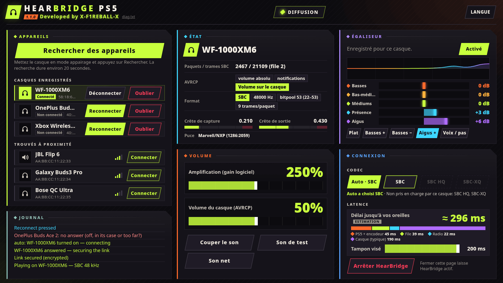

<div align="center">

# HearBridge PS5

**Casque Bluetooth pour une PS5 jailbreakée : son des jeux et du système, sans dongle.**

Développé par **X-F1REBALL-X**

🇺🇸 [English](README.md) · 🇸🇦 [العربية](README.ar.md) · 🇪🇸 [Español](README.es.md) · 🇫🇷 **Français** · 🇩🇪 [Deutsch](README.de.md) · 🇧🇷 [Português](README.pt.md) · 🇷🇺 [Русский](README.ru.md) · 🇯🇵 [日本語](README.ja.md) · 🇨🇳 [中文](README.zh.md) · 🇮🇹 [Italiano](README.it.md) · 🇮🇱 [עברית](README.he.md)

</div>

HearBridge PS5 est un payload (ELF) pour une PS5 jailbreakée. Il diffuse le son de la console via le Bluetooth de la PS5 elle-même vers un casque ou une enceinte Bluetooth ordinaire (A2DP). On le contrôle depuis une page web servie par la console. Il ne touche ni aux jeux, ni au firmware, ni au jailbreak.

<p align="center"></p>

## Prérequis

- Une PS5 jailbreakée avec un chargeur ELF sur le port **9021** (elfldr).
- Un casque ou une enceinte Bluetooth A2DP (SBC, 48 kHz stéréo).
- Un navigateur sur le même réseau (PS5, téléphone ou PC).

## Installer et lancer

1. Téléchargez **HearBridge-PS5-1.1.0.elf** depuis la [dernière version](https://github.com/X-F1REBALL-X/HearBridge-PS5/releases/latest).
2. Envoyez-le au chargeur : `socat -u FILE:HearBridge-PS5-1.1.0.elf TCP:<console-ip>:9021`
3. Ouvrez **http://&lt;console-ip&gt;:8090**, ou l'icône **HearBridge** de l'écran d'accueil.

Renvoyer l'ELF remplace la copie en cours. **Stop HearBridge** sur la page l'arrête.

## Quelle puce j'ai ?

Les PS5 utilisent l'une de deux puces Bluetooth : Marvell/NXP ou MediaTek. Les fat (CFI-11xx/12xx) et les Slim (CFI-20xx/21xx) peuvent avoir l'une ou l'autre, même avec le même numéro de modèle.

| Modèle | Téléchargement |
|---|---|
| CFI-10xx (lancement) | [1.1.0](https://github.com/X-F1REBALL-X/HearBridge-PS5/releases/tag/v1.1.0) |
| CFI-11xx, CFI-12xx (fat) | Vérifie ta puce: Marvell/NXP → [1.1.0](https://github.com/X-F1REBALL-X/HearBridge-PS5/releases/tag/v1.1.0), MediaTek → [mediatek test](https://github.com/X-F1REBALL-X/HearBridge-PS5/releases/tag/v1.1.0-mtk-test) |
| CFI-20xx, CFI-21xx (Slim) | Vérifie ta puce: Marvell/NXP → [1.1.0](https://github.com/X-F1REBALL-X/HearBridge-PS5/releases/tag/v1.1.0), MediaTek → [mediatek test](https://github.com/X-F1REBALL-X/HearBridge-PS5/releases/tag/v1.1.0-mtk-test) |
| CFI-70xx, CFI-71xx (Pro, toujours MediaTek) | [mediatek test](https://github.com/X-F1REBALL-X/HearBridge-PS5/releases/tag/v1.1.0-mtk-test) |

La version mediatek test n'est pas encore testée. La 1.1.0 n'est testée que sur une CFI-10xx. Dis-nous comment ça se passe.

**Comment vérifier :** lance la 1.1.0 et regarde la ligne **Chip** en bas du panneau **Status**. `Marvell/NXP (1286:…)` → garde la 1.1.0. `MediaTek (0e8d:…)` → prends mediatek test (la page affiche aussi un message orange). Ou ouvre `/data/hearbridge/hearbridge.log` et cherche `usb: /dev/ugen0.2 is 1286:2059 …` (le numéro ugen peut changer). Les quatre premiers caractères après « is » indiquent la puce : `1286` = Marvell/NXP, `0e8d` = MediaTek.

Sources: [Sony compliance (BR)](https://www.playstation.com/pt-br/legal/compliance/) · [24Wireless](https://24wireless.info/playstation-5-cfi-1100-series) · [TechInsights PS5 Pro teardown](https://www.techinsights.com/blog/sony-playstation-5-pro-teardown)

## Fonctions

- **Appairer :** mettez le casque en mode appairage, appuyez sur **Scan for devices** (20 s), puis **Connect**.
- **Connexion automatique :** les casques enregistrés se connectent seuls quand on les allume ou qu'on les sort du boîtier. Sortir une autre paire enregistrée bascule vers elle. Après un **Disconnect** manuel, ils attendent **Connect**.
- **Disconnect / Forget :** Disconnect coupe la liaison et garde le casque enregistré. Forget le déconnecte et le supprime.
- **Volume :** boost (gain logiciel jusqu'à 500 %, démarre à 250 %) et volume du casque (AVRCP, démarre à 50 %). Enregistrés par casque une fois modifiés. **Mute** et **Test tone** pour les vérifications.
- **Égaliseur :** 5 bandes (±12 dB) avec préréglages, enregistré par casque, avec un limiteur pour que le boost ne sature pas.
- **Latence :** cible de tampon de 60 à 200 ms (200 ms par défaut) et une estimation en direct du délai.
- **Clean sound :** coupe l'égaliseur, remet le boost à 250 % et le tampon à 200 ms.
- **Journal** sur la page avec chaque étape, en couleurs : vert réussi, rouge échoué, bleu pour vos appuis.

## Codecs

- **Auto :** SBC simple, marche avec tout.
- **SBC HQ** et **SBC-XQ :** à choisir à la main, seulement si le casque les prend en charge. Ceux non pris en charge sont grisés.

AAC, aptX et LDAC ne sont pas pris en charge.

## Limites connues

- Un casque à la fois, pas de micro. La TV continue aussi à jouer le son.
- Lancez un seul payload Bluetooth à la fois. La DualSense continue de fonctionner.
- Testé uniquement en fw 10.20 (PS5 fat, CFI-10xx). Les autres modèles et firmwares ne sont pas testés.
- Casques testés : Sony WF-1000XM6, OnePlus Buds Ace 2, Xbox Wireless Headset.

## Dépannage / signaler un problème

Au lancement du payload, la notification **"HearBridge &lt;version&gt;: starting"** doit apparaître. Sinon, le chargeur ne l'a pas lancé.

Les réglages, les casques enregistrés et le journal sont dans `/data/hearbridge/`. Pour signaler un problème :

1. Récupérez `/data/hearbridge/hearbridge.log` et `diag.txt` par FTP (par exemple [ftpsrv](https://github.com/ps5-payload-dev/ftpsrv), port 2121). `diag.txt` est aussi sur http://&lt;console-ip&gt;:8090/api/diag.
2. Ouvrez une [issue GitHub](https://github.com/X-F1REBALL-X/HearBridge-PS5/issues/new/choose) avec le modèle de console, le firmware, le chargeur, la version de HearBridge et les journaux.

## Compiler

```sh
export PS5_PAYLOAD_SDK=/opt/ps5-payload-sdk   # ps5-payload-sdk v0.43
make ps5      # dist/HearBridge-PS5-<version>.elf
make test
make send PS5_HOST=<console-ip>
```

## Licence

GPL-3.0-or-later. Voir [LICENSE](LICENSE) et [NOTICE](NOTICE).
