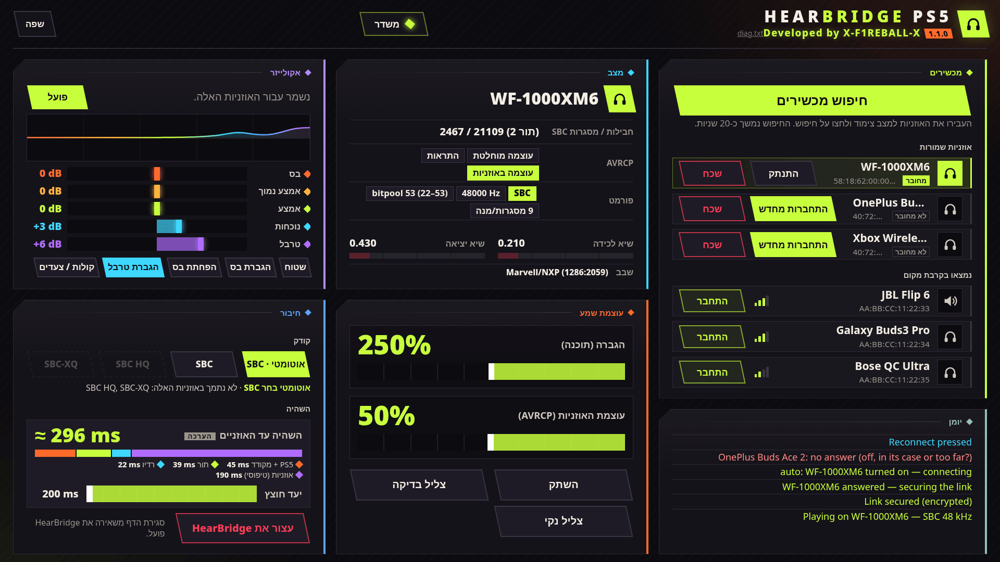

<div align="center">

# HearBridge PS5

**אוזניות בלוטות' ל-PS5 פרוץ: שמע המשחקים והמערכת, בלי דונגל.**

פותח על ידי **X-F1REBALL-X**

🇺🇸 [English](README.md) · 🇸🇦 [العربية](README.ar.md) · 🇪🇸 [Español](README.es.md) · 🇫🇷 [Français](README.fr.md) · 🇩🇪 [Deutsch](README.de.md) · 🇧🇷 [Português](README.pt.md) · 🇷🇺 [Русский](README.ru.md) · 🇯🇵 [日本語](README.ja.md) · 🇨🇳 [中文](README.zh.md) · 🇮🇹 [Italiano](README.it.md) · 🇮🇱 **עברית**

</div>

<div dir="rtl">

HearBridge PS5 הוא מטען (ELF) ל-PS5 פרוץ. הוא משדר את השמע של הקונסולה דרך הבלוטות' של ה-PS5 עצמו לאוזניות או לרמקול בלוטות' רגילים (A2DP). השליטה נעשית מדף אינטרנט שהקונסולה מגישה. הוא לא נוגע במשחקים, בקושחה או בפריצה.

<p align="center"></p>

## דרישות

- PS5 פרוץ עם טוען ELF בפורט **9021** (elfldr).
- אוזניות או רמקול בלוטות' עם A2DP (SBC, ‏48 kHz סטריאו).
- דפדפן באותה רשת (PS5, טלפון או מחשב).

## התקנה והפעלה

1. הורידו את **HearBridge-PS5-1.2.0.elf** מה[גרסה האחרונה](https://github.com/X-F1REBALL-X/HearBridge-PS5/releases/latest).
2. שלחו אותו לטוען: `socat -u FILE:HearBridge-PS5-1.2.0.elf TCP:<console-ip>:9021`
3. פתחו **http://&lt;console-ip&gt;:8090**, או את האריח **HearBridge** במסך הבית.

שליחה חוזרת של ה-ELF מחליפה את העותק שרץ. **Stop HearBridge** בדף עוצר אותו.

## איזה צ'יפ יש לי?

קובץ אחד עובד על שני שבבי הבלוטות', Marvell/NXP ו-MediaTek. HearBridge מזהה את השבב לבד ומציג אותו בשורה **Chip** בחלון **Status**.

| דגם | שבב בלוטות' |
|---|---|
| CFI-10xx (השקה) | Marvell/NXP |
| CFI-11xx, CFI-12xx (פאט) | Marvell/NXP או MediaTek |
| CFI-20xx, CFI-21xx (Slim) | Marvell/NXP או MediaTek |
| CFI-70xx, CFI-71xx (Pro) | MediaTek |

נבדק על: PS5 fat ‏CFI-10xx ‏(Marvell/NXP), ‏PS5 Slim ‏CFI-2008 ‏(MediaTek). בדגמים אחרים נשמח לשמוע איך הלך.

גם ב-`/data/hearbridge/hearbridge.log` השורה `usb: /dev/ugen0.2 is 1286:2059 …` מראה אותו: `1286` = Marvell/NXP, ‏`0e8d` = MediaTek.

מקורות: [Sony compliance (BR)](https://www.playstation.com/pt-br/legal/compliance/) · [24Wireless](https://24wireless.info/playstation-5-cfi-1100-series) · [TechInsights PS5 Pro teardown](https://www.techinsights.com/blog/sony-playstation-5-pro-teardown)

## תכונות

- **צימוד:** הכניסו את האוזניות למצב צימוד, לחצו **Scan for devices** (‏20 שניות) ואז **Connect**.
- **חיבור אוטומטי:** אוזניות שמורות מתחברות לבד כשמדליקים אותן או מוציאים מהקייס. הוצאה של זוג שמור אחר עוברת אליו. אחרי **Disconnect** ידני הן מחכות ל-**Connect**.
- **Disconnect / Forget:** ‏Disconnect מנתק ומשאיר את האוזניות שמורות. Forget מנתק ומוחק אותן.
- **עוצמה:** בוסט (הגברה בתוכנה עד 500 %, מתחיל ב-250 %) ועוצמת האוזניות (AVRCP, מתחילה ב-50 %). נשמרים לכל אוזניה אחרי שמשנים אותם. **Mute** ו-**Test tone** לבדיקות.
- **אקולייזר:** 5 תחומים (±12 dB) עם פריסטים, נשמר לכל אוזניה, עם לימיטר כך שהבוסט לא מעוות.
- **השהייה:** יעד באפר מ-60 עד 200 ms (ברירת מחדל 200 ms) והערכה חיה של ההשהייה.
- **Clean sound:** מכבה את האקולייזר, מחזיר את הבוסט ל-250 % ואת הבאפר ל-200 ms.
- **לוג** בדף עם כל שלב, בצבעים: ירוק הצליח, אדום נכשל, תכלת ללחיצות שלכם.

## קודקים

- **Auto:** ‏SBC רגיל, עובד עם הכל.
- **SBC HQ** ו-**SBC-XQ:** בחירה ידנית, רק כשהאוזניות תומכות בהם. כאלה שלא נתמכים מופיעים באפור.

אין תמיכה ב-AAC, ‏aptX ו-LDAC.

## מגבלות ידועות

- אוזניה אחת בכל פעם, בלי מיקרופון. גם הטלוויזיה ממשיכה להשמיע.
- הריצו רק מטען בלוטות' אחד בכל פעם. ה-DualSense ממשיך לעבוד.
- אוזניות שנבדקו: Sony WF-1000XM6, ‏OnePlus Buds Ace 2, ‏Xbox Wireless Headset.

## פתרון בעיות / דיווח על תקלה

כשהמטען רץ אמורה להופיע ההתראה **"HearBridge &lt;version&gt;: starting"**. אם היא לא מופיעה, הטוען לא הריץ אותו.

ההגדרות, האוזניות השמורות והלוג נמצאים ב-`/data/hearbridge/`. כדי לדווח על תקלה:

1. הורידו את `/data/hearbridge/hearbridge.log` ואת `diag.txt` ב-FTP (למשל [ftpsrv](https://github.com/ps5-payload-dev/ftpsrv), פורט 2121). ‏`diag.txt` זמין גם ב-http://&lt;console-ip&gt;:8090/api/diag.
2. פתחו [issue ב-GitHub](https://github.com/X-F1REBALL-X/HearBridge-PS5/issues/new/choose) עם דגם הקונסולה, הקושחה, הטוען, גרסת HearBridge וקבצי הלוג.

</div>

## בנייה

```sh
export PS5_PAYLOAD_SDK=/opt/ps5-payload-sdk   # ps5-payload-sdk v0.43
make ps5      # dist/HearBridge-PS5-<version>.elf
make test
make send PS5_HOST=<console-ip>
```

<div dir="rtl">

## רישיון

GPL-3.0-or-later. ראו [LICENSE](LICENSE) ו-[NOTICE](NOTICE).

</div>
