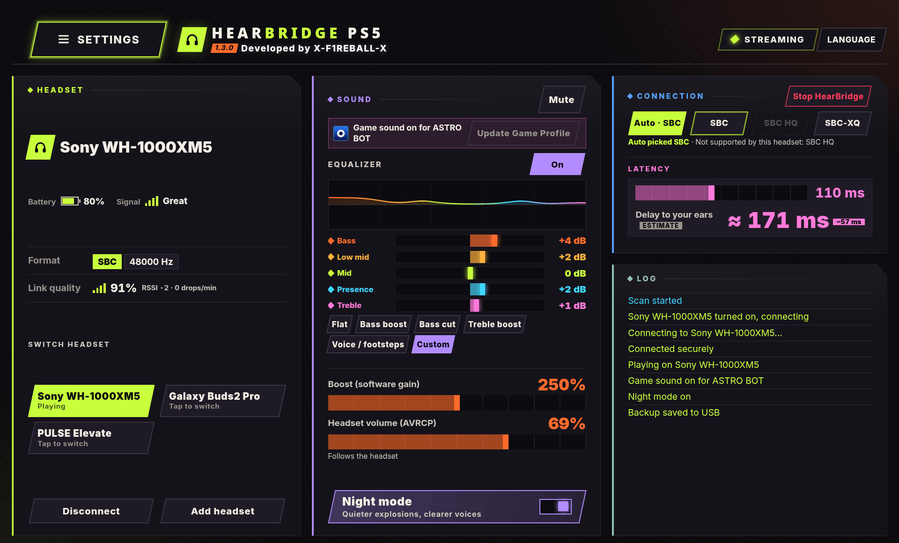

<div align="center">


# HearBridge PS5

**Cuffie Bluetooth per una PS5 con jailbreak: audio di giochi e sistema, senza dongle.**

Sviluppato da **X-F1REBALL-X**

🇺🇸 [English](README.md) · 🇸🇦 [العربية](README.ar.md) · 🇪🇸 [Español](README.es.md) · 🇫🇷 [Français](README.fr.md) · 🇩🇪 [Deutsch](README.de.md) · 🇧🇷 [Português](README.pt.md) · 🇷🇺 [Русский](README.ru.md) · 🇯🇵 [日本語](README.ja.md) · 🇨🇳 [中文](README.zh.md) · 🇮🇹 **Italiano**

</div>

HearBridge PS5 è un payload (ELF) che porta l'audio di giochi e sistema della tua PS5 su normali cuffie Bluetooth, usando il Bluetooth della console. Lo controlli da una pagina web servita dalla console.

<p align="center"></p>

## In evidenza

- Un solo file per ogni PS5, con Bluetooth Marvell/NXP o MediaTek.
- Profili di gioco: il suono segue il gioco e le cuffie.
- Batteria in percentuale, modalità notte e cambio cuffie con un tocco.

## Installare

1. Scarica **HearBridge-PS5-1.3.0.elf** dall'[ultima release](https://github.com/X-F1REBALL-X/HearBridge-PS5/releases/latest).
2. Invialo al tuo loader di ELF sulla porta 9021.
3. Apri **http://&lt;console-ip&gt;:8090** o il riquadro **HearBridge**, poi associa le cuffie in **Impostazioni**.

Tutto il resto, dalle funzioni alla risoluzione dei problemi, è nella **[guida](https://x-f1reball-x.github.io/HearBridge-PS5/)**.

## Compilare

```sh
export PS5_PAYLOAD_SDK=/opt/ps5-payload-sdk   # ps5-payload-sdk v0.43
make ps5      # dist/HearBridge-PS5-<version>.elf
make test
```

## Crediti

Pausa della scansione MediaTek, correzione della pipe USB e strumento di debug HCI, di [ZiZc3](https://github.com/ZiZc3) ([#6](https://github.com/X-F1REBALL-X/HearBridge-PS5/pull/6))

## Licenza

GPL-3.0-or-later. Vedi [LICENSE](LICENSE) e [NOTICE](NOTICE).
