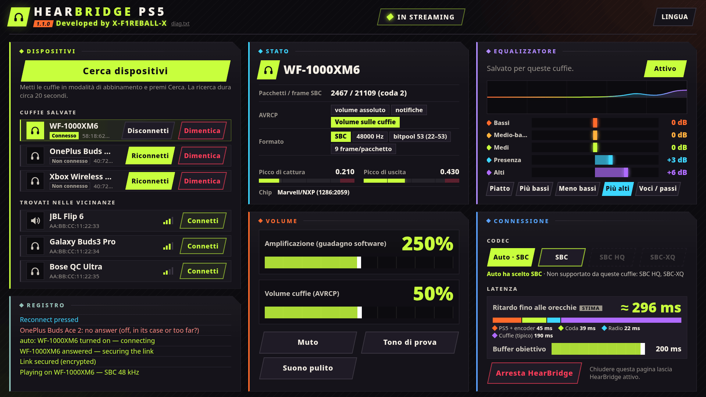

<div align="center">

# HearBridge PS5

**Cuffie Bluetooth per una PS5 con jailbreak: audio di giochi e sistema, senza dongle.**

Sviluppato da **X-F1REBALL-X**

🇺🇸 [English](README.md) · 🇸🇦 [العربية](README.ar.md) · 🇪🇸 [Español](README.es.md) · 🇫🇷 [Français](README.fr.md) · 🇩🇪 [Deutsch](README.de.md) · 🇧🇷 [Português](README.pt.md) · 🇷🇺 [Русский](README.ru.md) · 🇯🇵 [日本語](README.ja.md) · 🇨🇳 [中文](README.zh.md) · 🇮🇹 **Italiano** · 🇮🇱 [עברית](README.he.md)

</div>

HearBridge PS5 è un payload (ELF) per una PS5 con jailbreak. Trasmette l'audio della console tramite il Bluetooth della PS5 stessa a cuffie o altoparlanti Bluetooth normali (A2DP). Si controlla da una pagina web servita dalla console. Non tocca giochi, firmware o jailbreak.

<p align="center"></p>

## Requisiti

- Una PS5 con jailbreak e un loader ELF sulla porta **9021** (elfldr).
- Cuffie o altoparlante Bluetooth con A2DP (SBC, 48 kHz stereo).
- Un browser sulla stessa rete (PS5, telefono o PC).

## Installazione e avvio

1. Scarica **HearBridge-PS5-1.1.0.elf** dall'[ultima release](https://github.com/X-F1REBALL-X/HearBridge-PS5/releases/latest).
2. Invialo al loader: `socat -u FILE:HearBridge-PS5-1.1.0.elf TCP:<console-ip>:9021`
3. Apri **http://&lt;console-ip&gt;:8090**, oppure l'icona **HearBridge** nella schermata home.

Inviare di nuovo l'ELF sostituisce la copia in esecuzione. **Stop HearBridge** nella pagina lo chiude.

## Che chip ho?

Le PS5 usano uno di due chip Bluetooth: Marvell/NXP o MediaTek. Le fat (CFI-11xx/12xx) e le Slim (CFI-20xx/21xx) possono avere l'uno o l'altro, anche con lo stesso numero di modello.

| Modello | Download |
|---|---|
| CFI-10xx (lancio) | [1.1.0](https://github.com/X-F1REBALL-X/HearBridge-PS5/releases/tag/v1.1.0) |
| CFI-11xx, CFI-12xx (fat) | Controlla il chip: Marvell/NXP → [1.1.0](https://github.com/X-F1REBALL-X/HearBridge-PS5/releases/tag/v1.1.0), MediaTek → [mediatek test](https://github.com/X-F1REBALL-X/HearBridge-PS5/releases/tag/v1.1.0-mtk-test) |
| CFI-20xx, CFI-21xx (Slim) | Controlla il chip: Marvell/NXP → [1.1.0](https://github.com/X-F1REBALL-X/HearBridge-PS5/releases/tag/v1.1.0), MediaTek → [mediatek test](https://github.com/X-F1REBALL-X/HearBridge-PS5/releases/tag/v1.1.0-mtk-test) |
| CFI-70xx, CFI-71xx (Pro, sempre MediaTek) | [mediatek test](https://github.com/X-F1REBALL-X/HearBridge-PS5/releases/tag/v1.1.0-mtk-test) |

Testato: 1.1.0 su PS5 fat CFI-10xx (Marvell/NXP), mediatek test su PS5 Slim CFI-2008 (MediaTek). Altri modelli: facci sapere come va.

**Come controllare:** avvia la 1.1.0 e guarda la riga **Chip** in fondo al pannello **Status**. `Marvell/NXP (1286:…)` → resta sulla 1.1.0. `MediaTek (0e8d:…)` → usa mediatek test (la pagina mostra anche un avviso arancione). Oppure apri `/data/hearbridge/hearbridge.log` e cerca `usb: /dev/ugen0.2 is 1286:2059 …` (il numero ugen può cambiare). I primi quattro caratteri dopo "is" sono il chip: `1286` = Marvell/NXP, `0e8d` = MediaTek.

Fonti: [Sony compliance (BR)](https://www.playstation.com/pt-br/legal/compliance/) · [24Wireless](https://24wireless.info/playstation-5-cfi-1100-series) · [TechInsights PS5 Pro teardown](https://www.techinsights.com/blog/sony-playstation-5-pro-teardown)

## Funzioni

- **Abbinare:** metti le cuffie in modalità abbinamento, premi **Scan for devices** (20 s), poi **Connect**.
- **Connessione automatica:** le cuffie salvate si connettono da sole quando le accendi o le togli dalla custodia. Togliendo un altro paio salvato si passa a quello. Dopo un **Disconnect** manuale aspettano **Connect**.
- **Disconnect / Forget:** Disconnect chiude il collegamento e lascia le cuffie salvate. Forget le disconnette e le rimuove.
- **Volume:** boost (guadagno software fino a 500 %, parte da 250 %) e volume delle cuffie (AVRCP, parte da 50 %). Salvati per cuffia quando li cambi. **Mute** e **Test tone** per le prove.
- **Equalizzatore:** 5 bande (±12 dB) con preset, salvato per cuffia, con limiter così il boost non distorce.
- **Latenza:** obiettivo del buffer da 60 a 200 ms (predefinito 200 ms) e una stima del ritardo in tempo reale.
- **Clean sound:** spegne l'equalizzatore, riporta il boost a 250 % e il buffer a 200 ms.
- **Log** nella pagina con ogni passaggio, a colori: verde riuscito, rosso fallito, blu per quello che premi.

## Codec

- **Auto:** SBC semplice, funziona con tutto.
- **SBC HQ** e **SBC-XQ:** da scegliere a mano, solo se le cuffie li supportano. Quelli non supportati sono in grigio.

AAC, aptX e LDAC non sono supportati.

## Limiti noti

- Una cuffia alla volta, niente microfono. Anche la TV continua a riprodurre l'audio.
- Esegui un solo payload Bluetooth alla volta. Il DualSense continua a funzionare.
- Cuffie testate: Sony WF-1000XM6, OnePlus Buds Ace 2, Xbox Wireless Headset.

## Risoluzione dei problemi / segnalare un problema

All'avvio del payload dovrebbe comparire la notifica **"HearBridge &lt;version&gt;: starting"**. Se non compare, il loader non l'ha eseguito.

Impostazioni, cuffie salvate e log sono in `/data/hearbridge/`. Per segnalare un problema:

1. Scarica `/data/hearbridge/hearbridge.log` e `diag.txt` via FTP (per esempio [ftpsrv](https://github.com/ps5-payload-dev/ftpsrv), porta 2121). `diag.txt` è anche su http://&lt;console-ip&gt;:8090/api/diag.
2. Apri una [issue su GitHub](https://github.com/X-F1REBALL-X/HearBridge-PS5/issues/new/choose) con modello della console, firmware, loader, versione di HearBridge e i log.

## Compilazione

```sh
export PS5_PAYLOAD_SDK=/opt/ps5-payload-sdk   # ps5-payload-sdk v0.43
make ps5      # dist/HearBridge-PS5-<version>.elf
make test
make send PS5_HOST=<console-ip>
```

## Licenza

GPL-3.0-or-later. Vedi [LICENSE](LICENSE) e [NOTICE](NOTICE).
