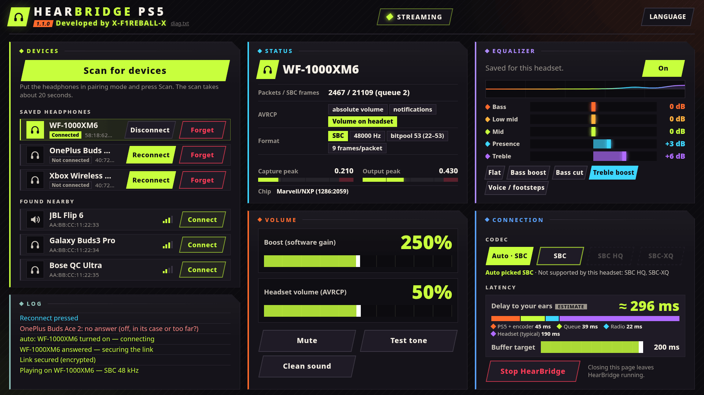

<div align="center">

# HearBridge PS5

**Fones Bluetooth para um PS5 desbloqueado: áudio dos jogos e do sistema, sem adaptador.**

Desenvolvido por **X-F1REBALL-X**

🇺🇸 [English](README.md) · 🇸🇦 [العربية](README.ar.md) · 🇪🇸 [Español](README.es.md) · 🇫🇷 [Français](README.fr.md) · 🇩🇪 [Deutsch](README.de.md) · 🇧🇷 **Português** · 🇷🇺 [Русский](README.ru.md) · 🇯🇵 [日本語](README.ja.md) · 🇨🇳 [中文](README.zh.md) · 🇮🇹 [Italiano](README.it.md) · 🇮🇱 [עברית](README.he.md)

</div>

HearBridge PS5 é um payload (ELF) para um PS5 desbloqueado. Ele captura o áudio do console e o transmite pelo próprio rádio Bluetooth do console para fones ou caixas de som Bluetooth comuns (A2DP, SBC). O controle é feito por uma página web servida pelo console. Não modifica jogos, firmware nem o desbloqueio.

<p align="center"></p>

## Requisitos

- Um PS5 desbloqueado com um carregador de ELF escutando na porta **9021** (elfldr).
- Fones ou uma caixa de som Bluetooth com **A2DP** (SBC).
- O navegador do PS5, um celular ou um PC na mesma rede.

## Instalação e execução

1. Baixe **HearBridge-PS5-1.0.2.elf** na [versão](https://github.com/X-F1REBALL-X/HearBridge-PS5/releases/tag/v1.0.2).
2. Envie-o ao carregador do console, por exemplo:
   `socat -u FILE:HearBridge-PS5-1.0.2.elf TCP:<console-ip>:9021`
3. Abra **http://&lt;console-ip&gt;:8090** (ou o bloco **HearBridge** adicionado à tela inicial na primeira execução).

## Uso

- **Parear:** coloque os fones no modo de pareamento, toque em **Procurar dispositivos** (cerca de 20 s) e depois em **Conectar** ao lado deles. Eles são salvos e o áudio começa.
- **Conectar:** dispositivos salvos só se conectam quando você toca em **Conectar** na linha deles. Nada se conecta em segundo plano.
- **Desconectar:** encerra a conexão; o dispositivo continua salvo. Se os fones voltarem para o estojo ou saírem do alcance, a página mostra **Não conectado** até você tocar em Conectar de novo.
- **Esquecer:** remove o dispositivo e a chave de pareamento.
- **Volume:** o controle de reforço (ganho por software, até 500 %) e o volume do fone (volume absoluto AVRCP, que também segue os botões do fone). **Silenciar** e **Tom de teste** ajudam nos testes.
- **Parar o HearBridge** encerra o payload de forma limpa. Use antes de carregar o ELF novamente.

A página está disponível em 11 idiomas, incluindo hebraico e árabe (da direita para a esquerda).

## Observações

- Usa o Bluetooth integrado do PS5; o DualSense continua funcionando. Execute apenas um payload que use Bluetooth por vez.
- Apenas codec SBC, um dispositivo por vez, sem microfone. A TV também continua tocando o som.
- Testado com Sony WF-1000XM6, OnePlus Buds Ace 2 e Xbox Wireless Headset.
- As configurações, os dispositivos salvos e o log ficam em `/data/hearbridge/` (`hearbridge.log` registra cada etapa).

## Solução de problemas / relatar um problema

**Testado em:** o HearBridge foi desenvolvido e testado em um PS5 fat (modelo original, CFI-10xx) com firmware 10.20. Outros modelos (Slim, Pro, revisões fat posteriores) e outros firmwares não foram testados e podem usar outro chip Bluetooth, então relatos deles são bem-vindos.

Problemas comuns:

- **O ícone do HearBridge não aparece na tela inicial** depois de executar o ELF.
- **A página não abre** (http://&lt;console-ip&gt;:8090).
- **Os fones não são encontrados** ao tocar em Procurar dispositivos.
- **Não há som** mesmo com os fones conectados.

**Firmware 13.60:** experimente **HearBridge-PS5-1.0.2-fw13.60.elf** da [versão v1.0.2](https://github.com/X-F1REBALL-X/HearBridge-PS5/releases/tag/v1.0.2). É uma versão experimental feita para corrigir o ícone que falta na tela inicial e adiciona diagnósticos. Ela ainda não foi testada em um console real.

**Como obter o log:**

1. Envie um payload de servidor FTP (por exemplo [ftpsrv](https://github.com/ps5-payload-dev/ftpsrv)) pelo mesmo carregador que você usa para o HearBridge.
2. Conecte-se com o FileZilla ao IP do console, na porta que o servidor mostra (o ftpsrv normalmente usa a **2121**).
3. Baixe `/data/hearbridge/hearbridge.log` e, com a versão fw13.60, também `/data/hearbridge/diag.txt`.

Com a versão fw13.60 você também pode abrir **http://&lt;console-ip&gt;:8090/api/diag** e copiar o texto.

**Abra uma [issue no GitHub](https://github.com/X-F1REBALL-X/HearBridge-PS5/issues/new/choose)** e inclua:

- o modelo do console (número CFI, ex.: CFI-1016A)
- a versão do firmware
- o carregador que você usou
- se a notificação **"HearBridge 1.0.2: http://…"** apareceu
- se a página abre
- os arquivos de log (`hearbridge.log`, `diag.txt`)

## Compilação

```sh
export PS5_PAYLOAD_SDK=/opt/ps5-payload-sdk
make ps5
make test
```

## Licença

GPL-3.0-or-later. Veja [LICENSE](LICENSE) e [NOTICE](NOTICE).

---

<p align="center">Developed by X-F1REBALL-X</p>
