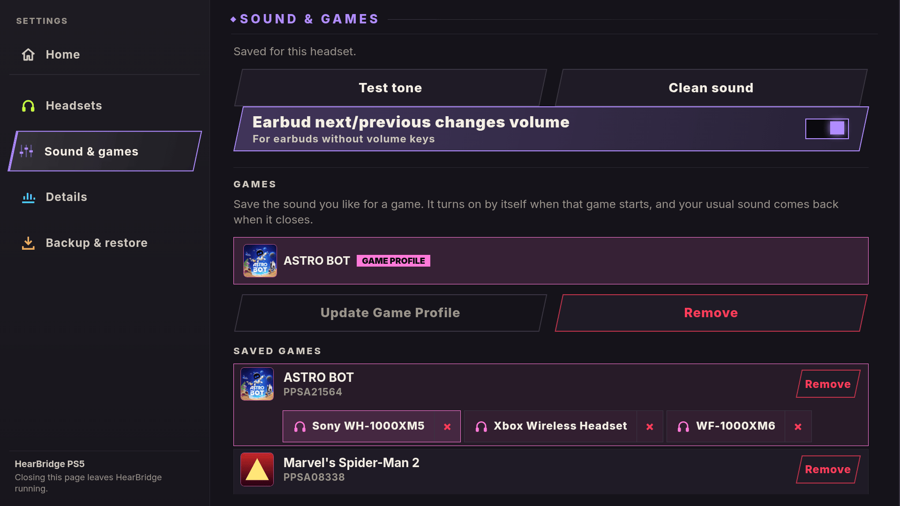

<div align="center">


# HearBridge PS5

**Bluetooth-наушники для взломанной PS5: звук игр и системы, без донгла.**

Разработчик: **X-F1REBALL-X**

🇺🇸 [English](README.md) · 🇸🇦 [العربية](README.ar.md) · 🇪🇸 [Español](README.es.md) · 🇫🇷 [Français](README.fr.md) · 🇩🇪 [Deutsch](README.de.md) · 🇧🇷 [Português](README.pt.md) · 🇷🇺 **Русский** · 🇯🇵 [日本語](README.ja.md) · 🇨🇳 [中文](README.zh.md) · 🇮🇹 [Italiano](README.it.md)

</div>

HearBridge PS5 это payload (ELF), который выводит звук игр и системы PS5 на обычные Bluetooth-наушники через собственный Bluetooth консоли. Управление идёт через веб-страницу, которую отдаёт консоль.

<p align="center"> </p>

## Главное

- Один файл для любой PS5, с Bluetooth Marvell/NXP или MediaTek.
- Профили игр: звук подстраивается под игру и наушники.
- Заряд в процентах, ночной режим и смена наушников одним нажатием.

## Установка

1. Скачайте **HearBridge-PS5-1.3.0.elf** из [последнего релиза](https://github.com/X-F1REBALL-X/HearBridge-PS5/releases/latest).
2. Отправьте его загрузчику ELF на порт 9021.
3. Откройте **http://&lt;console-ip&gt;:8090** или плитку **HearBridge** и подключите наушники в разделе **Настройки**.

Всё остальное, от функций до решения проблем, есть в **[руководстве](https://x-f1reball-x.github.io/HearBridge-PS5/)**.

## Сборка

```sh
export PS5_PAYLOAD_SDK=/opt/ps5-payload-sdk   # ps5-payload-sdk v0.43
make ps5      # dist/HearBridge-PS5-<version>.elf
make test
```

## Благодарности

Пауза сканирования MediaTek, исправление USB-канала и инструмент отладки HCI: [ZiZc3](https://github.com/ZiZc3) ([#6](https://github.com/X-F1REBALL-X/HearBridge-PS5/pull/6))

## Лицензия

GPL-3.0-or-later. См. [LICENSE](LICENSE) и [NOTICE](NOTICE).

[Поддержать проект на Ko-fi](https://ko-fi.com/xf1reballx). Проект остаётся бесплатным и с открытым исходным кодом.
