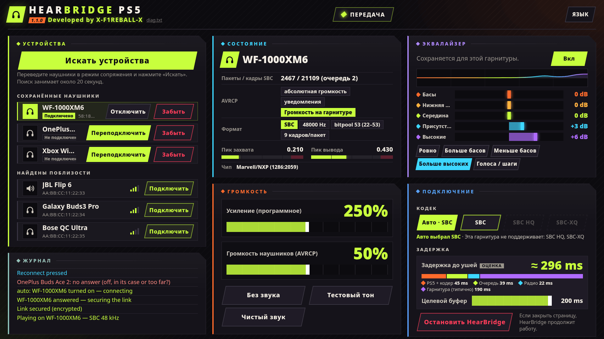

<div align="center">

# HearBridge PS5

**Bluetooth-наушники для взломанной PS5: звук игр и системы, без донгла.**

Разработчик: **X-F1REBALL-X**

🇺🇸 [English](README.md) · 🇸🇦 [العربية](README.ar.md) · 🇪🇸 [Español](README.es.md) · 🇫🇷 [Français](README.fr.md) · 🇩🇪 [Deutsch](README.de.md) · 🇧🇷 [Português](README.pt.md) · 🇷🇺 **Русский** · 🇯🇵 [日本語](README.ja.md) · 🇨🇳 [中文](README.zh.md) · 🇮🇹 [Italiano](README.it.md)

</div>

HearBridge PS5 — это payload (ELF) для взломанной PS5. Он передаёт звук консоли через собственный Bluetooth PS5 на обычные Bluetooth-наушники или колонки (A2DP). Управление — через веб-страницу, которую отдаёт консоль. Игры, прошивку и взлом он не трогает.

<p align="center"></p>

## Требования

- Взломанная PS5 с ELF-загрузчиком на порту **9021** (elfldr).
- Bluetooth-наушники или колонка с A2DP (SBC, 48 кГц стерео).
- Браузер в той же сети (PS5, телефон или ПК).

## Установка и запуск

1. Скачайте **HearBridge-PS5-1.2.0.elf** из [последнего релиза](https://github.com/X-F1REBALL-X/HearBridge-PS5/releases/latest).
2. Отправьте его загрузчику: `socat -u FILE:HearBridge-PS5-1.2.0.elf TCP:<console-ip>:9021`
3. Откройте **http://&lt;console-ip&gt;:8090** или плитку **HearBridge** на главном экране.

Повторная отправка ELF заменяет запущенную копию. **Stop HearBridge** на странице останавливает его.

## Какой у меня чип?

Один файл работает с обоими Bluetooth-чипами, Marvell/NXP и MediaTek. HearBridge сам определяет чип и показывает его в строке **Chip** панели **Status**.

| Модель | Bluetooth-чип |
|---|---|
| CFI-10xx (первая модель) | Marvell/NXP |
| CFI-11xx, CFI-12xx (fat) | Marvell/NXP или MediaTek |
| CFI-20xx, CFI-21xx (Slim) | Marvell/NXP или MediaTek |
| CFI-70xx, CFI-71xx (Pro) | MediaTek |

Проверено на: PS5 fat CFI-10xx (Marvell/NXP), PS5 Slim CFI-2008 (MediaTek). Другие модели: расскажите, как работает.

В `/data/hearbridge/hearbridge.log` его видно и в строке `usb: /dev/ugen0.2 is 1286:2059 …`: `1286` = Marvell/NXP, `0e8d` = MediaTek.

Источники: [Sony compliance (BR)](https://www.playstation.com/pt-br/legal/compliance/) · [24Wireless](https://24wireless.info/playstation-5-cfi-1100-series) · [TechInsights PS5 Pro teardown](https://www.techinsights.com/blog/sony-playstation-5-pro-teardown)

## Возможности

- **Сопряжение:** переведите наушники в режим сопряжения, нажмите **Scan for devices** (20 с), затем **Connect**.
- **Автоподключение:** сохранённые наушники подключаются сами, когда их включают или достают из кейса. Если достать другую сохранённую пару, звук переключится на неё. После ручного **Disconnect** они ждут **Connect**.
- **Disconnect / Forget:** Disconnect разрывает связь, наушники остаются сохранёнными. Forget отключает и удаляет их.
- **Громкость:** усиление (программное, до 500 %, по умолчанию 250 %) и громкость наушников (AVRCP, по умолчанию 50 %). Сохраняются для каждых наушников после изменения. **Mute** и **Test tone** для проверки.
- **Эквалайзер:** 5 полос (±12 дБ) с пресетами, сохраняется для каждых наушников, с лимитером, чтобы усиление не искажало звук.
- **Задержка:** целевой буфер от 60 до 200 мс (по умолчанию 200 мс) и оценка задержки в реальном времени.
- **Clean sound:** выключает эквалайзер, возвращает усиление на 250 % и буфер на 200 мс.
- **Лог** на странице с каждым шагом, в цвете: зелёный — получилось, красный — ошибка, голубой — ваши нажатия.

## Кодеки

- **Auto:** обычный SBC, работает со всем.
- **SBC HQ** и **SBC-XQ:** выбираются вручную, только если наушники их поддерживают. Неподдерживаемые показаны серым.

AAC, aptX и LDAC не поддерживаются.

## Известные ограничения

- Одни наушники за раз, без микрофона. Телевизор тоже продолжает играть звук.
- Запускайте только один Bluetooth-payload одновременно. DualSense продолжает работать.
- Проверенные наушники: Sony WF-1000XM6, OnePlus Buds Ace 2, Xbox Wireless Headset.

## Решение проблем / как сообщить о проблеме

При запуске payload должно появиться уведомление **"HearBridge &lt;version&gt;: starting"**. Если его нет, загрузчик его не запустил.

Настройки, сохранённые наушники и лог лежат в `/data/hearbridge/`. Чтобы сообщить о проблеме:

1. Скачайте `/data/hearbridge/hearbridge.log` и `diag.txt` по FTP (например, [ftpsrv](https://github.com/ps5-payload-dev/ftpsrv), порт 2121). `diag.txt` также доступен по адресу http://&lt;console-ip&gt;:8090/api/diag.
2. Создайте [issue на GitHub](https://github.com/X-F1REBALL-X/HearBridge-PS5/issues/new/choose) с моделью консоли, прошивкой, загрузчиком, версией HearBridge и логами.

## Сборка

```sh
export PS5_PAYLOAD_SDK=/opt/ps5-payload-sdk   # ps5-payload-sdk v0.43
make ps5      # dist/HearBridge-PS5-<version>.elf
make test
make send PS5_HOST=<console-ip>
```

## Лицензия

GPL-3.0-or-later. См. [LICENSE](LICENSE) и [NOTICE](NOTICE).
