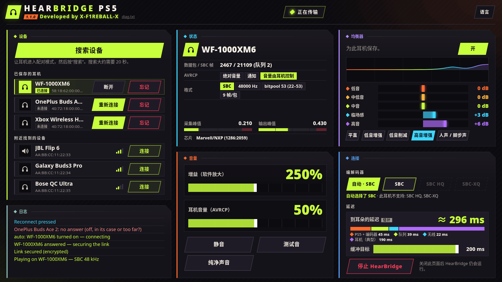

<div align="center">

# HearBridge PS5

**为破解的 PS5 使用蓝牙耳机：游戏和系统声音，无需适配器。**

开发者：**X-F1REBALL-X**

🇺🇸 [English](README.md) · 🇸🇦 [العربية](README.ar.md) · 🇪🇸 [Español](README.es.md) · 🇫🇷 [Français](README.fr.md) · 🇩🇪 [Deutsch](README.de.md) · 🇧🇷 [Português](README.pt.md) · 🇷🇺 [Русский](README.ru.md) · 🇯🇵 [日本語](README.ja.md) · 🇨🇳 **中文** · 🇮🇹 [Italiano](README.it.md) · 🇮🇱 [עברית](README.he.md)

</div>

HearBridge PS5 是用于破解 PS5 的 payload（ELF）。它通过 PS5 自带的蓝牙把主机声音传到普通蓝牙耳机或音箱（A2DP）。通过主机提供的网页进行控制。它不会改动游戏、固件或破解。

<p align="center"></p>

## 要求

- 已破解的 PS5，ELF 加载器监听端口 **9021**（elfldr）。
- 支持 A2DP（SBC，48 kHz 立体声）的蓝牙耳机或音箱。
- 同一网络中的浏览器（PS5、手机或电脑）。

## 安装和运行

1. 从[最新版本](https://github.com/X-F1REBALL-X/HearBridge-PS5/releases/latest)下载 **HearBridge-PS5-1.2.0.elf**。
2. 发送到加载器：`socat -u FILE:HearBridge-PS5-1.2.0.elf TCP:<console-ip>:9021`
3. 打开 **http://&lt;console-ip&gt;:8090**，或主屏幕上的 **HearBridge** 图标。

再次发送 ELF 会替换正在运行的副本。页面上的 **Stop HearBridge** 可以停止它。

## 我的是哪种芯片？

一个文件同时支持 Marvell/NXP 和 MediaTek 两种蓝牙芯片。HearBridge 会自动识别芯片，并显示在 **Status** 面板的 **Chip** 行。

| 型号 | 蓝牙芯片 |
|---|---|
| CFI-10xx (首发) | Marvell/NXP |
| CFI-11xx, CFI-12xx (初代) | Marvell/NXP 或 MediaTek |
| CFI-20xx, CFI-21xx (Slim) | Marvell/NXP 或 MediaTek |
| CFI-70xx, CFI-71xx (Pro) | MediaTek |

已测试：PS5 fat CFI-10xx（Marvell/NXP），PS5 Slim CFI-2008（MediaTek）。其他型号欢迎反馈结果。

在 `/data/hearbridge/hearbridge.log` 的 `usb: /dev/ugen0.2 is 1286:2059 …` 行也能看到：`1286` = Marvell/NXP，`0e8d` = MediaTek。

来源: [Sony compliance (BR)](https://www.playstation.com/pt-br/legal/compliance/) · [24Wireless](https://24wireless.info/playstation-5-cfi-1100-series) · [TechInsights PS5 Pro teardown](https://www.techinsights.com/blog/sony-playstation-5-pro-teardown)

## 功能

- **配对：**让耳机进入配对模式，按 **Scan for devices**（20 秒），然后按 **Connect**。
- **自动连接：**已保存的耳机在开机或从充电盒取出时自动连接。取出另一副已保存的耳机会切换过去。手动 **Disconnect** 后会等待 **Connect**。
- **Disconnect / Forget：**Disconnect 断开连接，耳机保持已保存。Forget 断开并删除。
- **音量：**增益（软件增益最高 500 %，初始 250 %）和耳机音量（AVRCP，初始 50 %）。修改后按耳机保存。**Mute** 和 **Test tone** 用于检查。
- **均衡器：**5 个频段（±12 dB），带预设，按耳机保存，带限幅器，增益不会失真。
- **延迟：**缓冲目标 60 到 200 ms（默认 200 ms），并实时估算延迟。
- **Clean sound：**关闭均衡器，增益恢复到 250 %，缓冲恢复到 200 ms。
- 页面上有记录每一步的彩色**日志**：绿色表示成功，红色表示失败，蓝色表示你的操作。

## 编解码器

- **Auto：**普通 SBC，兼容所有设备。
- **SBC HQ** 和 **SBC-XQ：**手动选择，仅在耳机支持时可用。不支持的显示为灰色。

不支持 AAC、aptX 和 LDAC。

## 已知限制

- 一次只能连一个耳机，没有麦克风。电视也会继续播放声音。
- 一次只运行一个使用蓝牙的 payload。DualSense 照常工作。
- 已测试耳机：Sony WF-1000XM6、OnePlus Buds Ace 2、Xbox Wireless Headset。

## 故障排除 / 报告问题

运行 payload 后应出现 **“HearBridge &lt;version&gt;: starting”** 通知。如果没有，说明加载器没有运行它。

设置、已保存的耳机和日志位于 `/data/hearbridge/`。报告问题：

1. 通过 FTP 下载 `/data/hearbridge/hearbridge.log` 和 `diag.txt`（例如 [ftpsrv](https://github.com/ps5-payload-dev/ftpsrv)，端口 2121）。`diag.txt` 也可在 http://&lt;console-ip&gt;:8090/api/diag 查看。
2. 创建 [GitHub issue](https://github.com/X-F1REBALL-X/HearBridge-PS5/issues/new/choose)，附上主机型号、固件、加载器、HearBridge 版本和日志文件。

## 构建

```sh
export PS5_PAYLOAD_SDK=/opt/ps5-payload-sdk   # ps5-payload-sdk v0.43
make ps5      # dist/HearBridge-PS5-<version>.elf
make test
make send PS5_HOST=<console-ip>
```

## 许可证

GPL-3.0-or-later。见 [LICENSE](LICENSE) 和 [NOTICE](NOTICE)。
